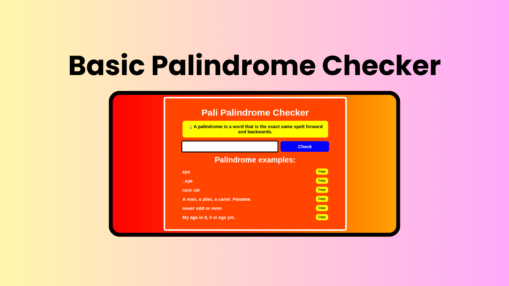
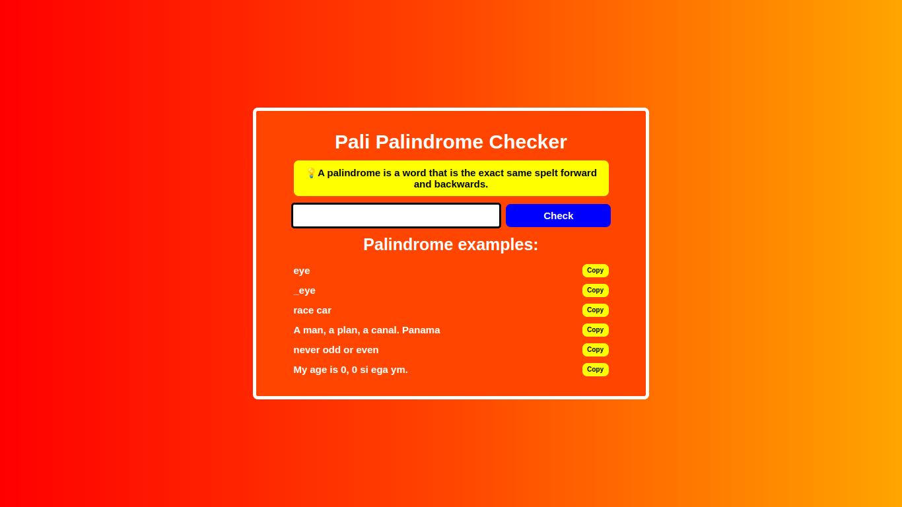

# Palindrome_Checker
A simple Palindrome Checker made with HTML, CSS, and Javascript. 

A simple Palindrome Checker, made with HTML, CSS and JavaScript. Feel free to check <a href="https://palindrome-checker-wheat.vercel.app/" target="_blank">the project</a> out, and give feedback on what I can improve if you like .

## Technologies:
1. HTML
2. CSS
3. JavaScript

## What is a Palindrome?
According to Google: "A palindrome is a word, sentence, verse, or even number that reads the same backward or forward."

## Project Motive:
The reason I made this project is because I had the opportunity to apply what I've learnt by following feeCodeCamp's Curriculum. I built this project on my own, as a certification project for <a href="https://www.freecodecamp.org/learn/javascript-algorithms-and-data-structures-v8/" target="_blank">JavaScript Algorithms and Data Structures Course</a> on freeCodeCamp.

## Contributions:
If you really like the project, and you see something you can improve, feel free to **fork** this repo, make your changes, and submit a pull request. If you see any spelling mistake on this markdown file, or on the website, please make an **issue**, so that I can fix it. Thanks. Recommendations on how I can improve it would be great.

## What I learnt from making this project:
1. HTML
2. CSS
3. Mobile Responsiveness
4. JavaScript
5. Regex Patterns
6. Form Validation
7. DRY - Writing re-usable code.

## License:
This project is under the MIT license. Feel free to do whatever you wnat with it, I really don't care.

## Conclusion:
If you are someone that are looking to hire a developer, whether it is freelancing work, an internship, or a full time position, feel free to reach out to me with one of the following channels: 

  
  
  &nbsp;&nbsp;&nbsp;

